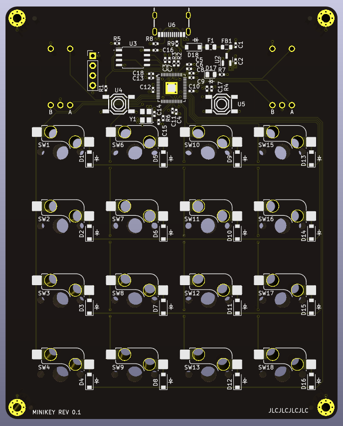
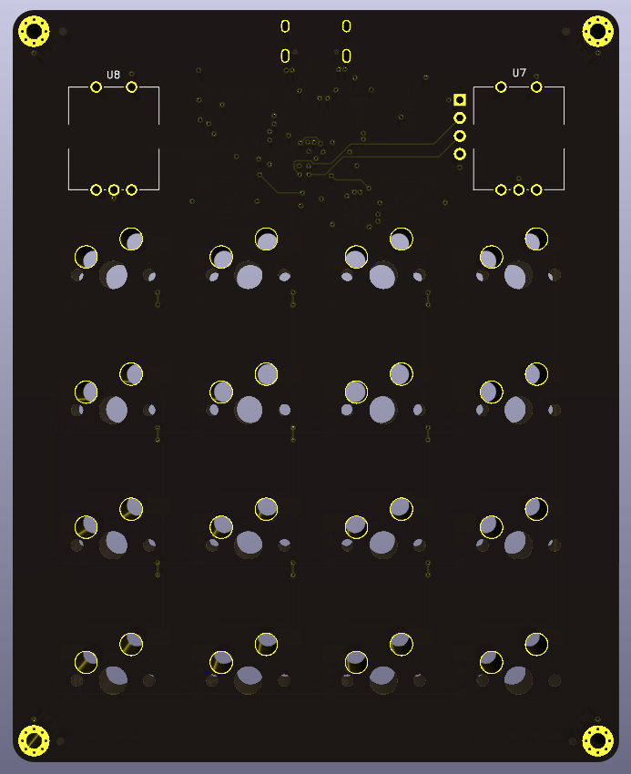

# Minikey

Mini is a macropad.

## Rev 0.1

### Rev 0.1 Issues

Only related to the BOM.
- Button were not assembled
- R2,R3 are 27K instead of 27 Ohm.

# Characteristics

- 2 rotatry encoders
- 16 keys (Cherry MX, hot swappable)
- USB-C
- RP2040 MCU

